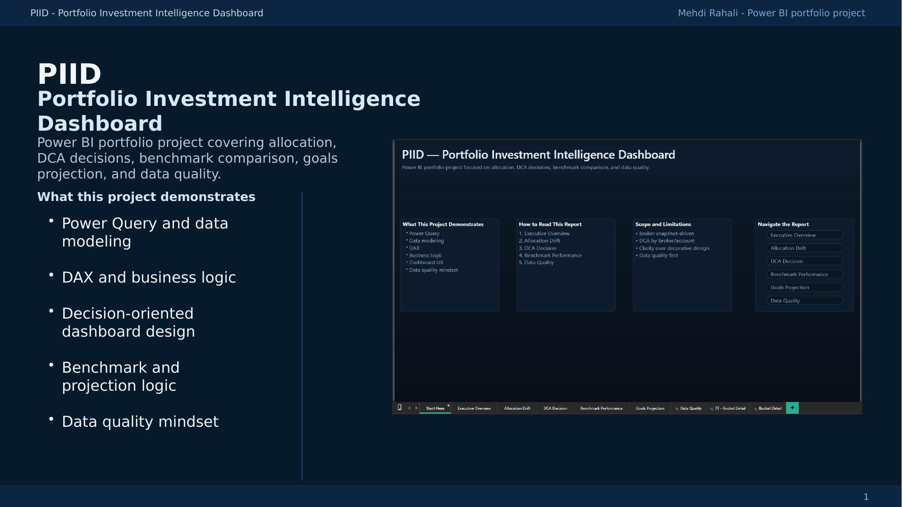
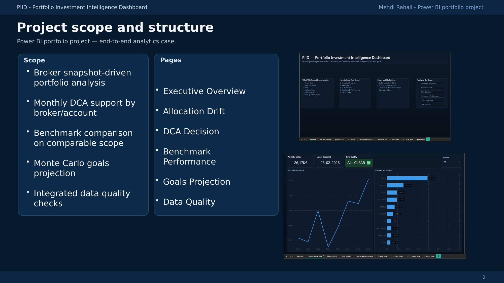
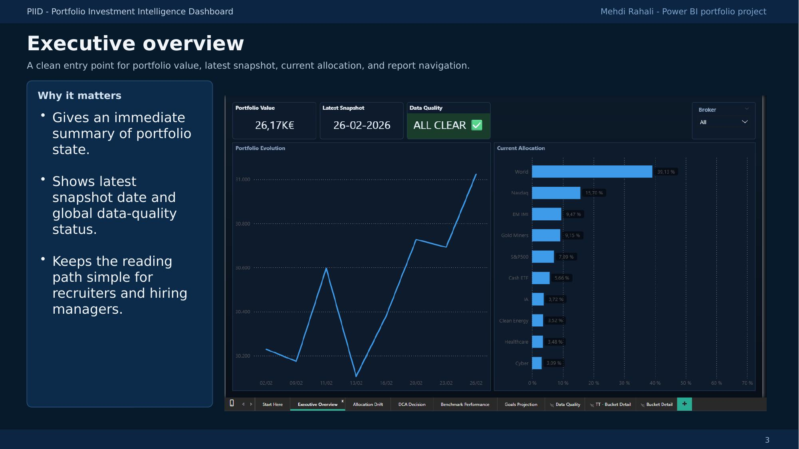
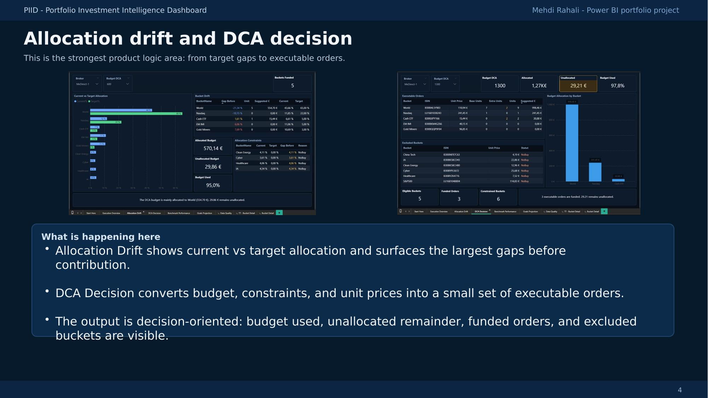
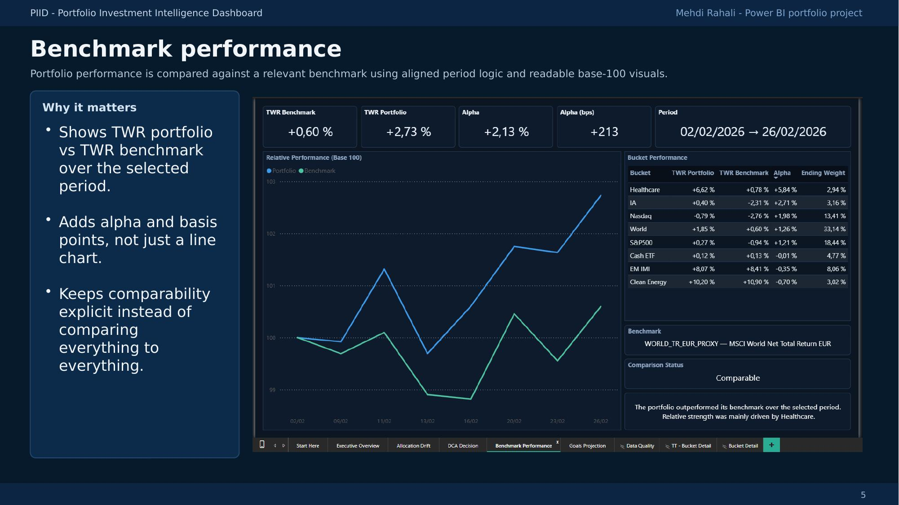
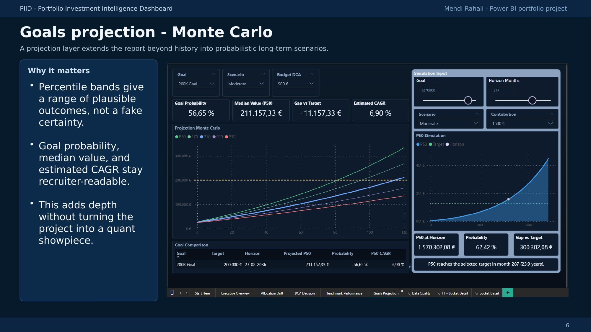
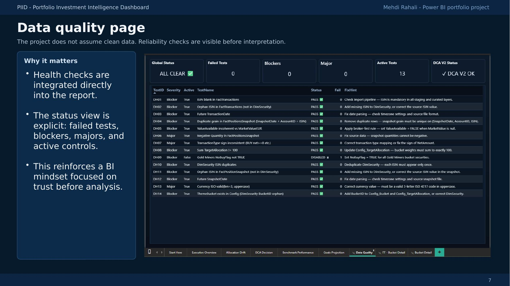

# PIID — Portfolio Investment Intelligence Dashboard

> A personal finance analytics project built in Power BI, tracking a real multi-account ETF portfolio across two Belgian brokers.



---

## Overview

PIID turns raw broker snapshots and trade confirmations into a decision-oriented dashboard covering allocation drift, DCA execution, benchmark comparison, probabilistic projection, and integrated data quality checks.

The project is used as a personal FIRE (Financial Independence, Retire Early) tool and as a recruiter-facing portfolio piece demonstrating end-to-end BI work on a real, live dataset.

---

## What this project demonstrates

| Area | Detail |
|---|---|
| **Data modeling** | Star schema — fact tables + dimension tables, clean separation of concerns |
| **Power Query / ETL** | Multi-source ingestion from broker CSV exports, data cleaning, snapshot logic |
| **DAX** | Time Intelligence, YoY, TWR, benchmark delta, Monte Carlo percentile bands, data quality measures |
| **Dashboard design** | Decision-oriented UX — each page answers one question |
| **Data quality mindset** | Integrated health checks visible before any interpretation |

---

## Project scope

**Data sources**
- MeDirect broker — monthly snapshot exports
- Belfius broker — monthly snapshot exports
- Manual Config table — target allocation, DCA budget, unit price snapshots

**Pages**

| Page | Purpose |
|---|---|
| Executive Overview | Portfolio value, latest snapshot date, global data quality status |
| Allocation Drift | Current vs target allocation — surfaces gaps before contribution |
| DCA Decision | Converts budget + constraints + unit prices into executable integer-unit orders |
| Benchmark Performance | TWR portfolio vs TWR benchmark — alpha and basis points, base-100 visuals |
| Goals Projection | Monte Carlo simulation — percentile bands, goal probability, median value, estimated CAGR |
| Data Quality | Health checks dashboard — failed tests, blockers, majors, active controls |

---

## Screenshots

| | |
|---|---|
|  |  |
|  |  |
|  |  |

---

## Architecture

```
Config_PriceSnapshot  ──┐
Broker_MeDirect       ──┤──► FactPortfolio ──► Measures (DAX)
Broker_Belfius        ──┤
DimDate               ──┘
DimETF                ──┘
```

Key design decisions:
- **Snapshot-driven model** — no real-time feed, deliberate design for auditability
- **TWR calculation** — time-weighted return implemented in DAX, handles irregular cash flows
- **Integer-unit DCA engine** — Config_PriceSnapshot drives executable orders (not theoretical weights)
- **Benchmark on comparable scope** — benchmark filtered to match actual portfolio period, not total market history
- **Monte Carlo in DAX** — percentile simulation without R or Python dependency

---

## Key DAX patterns

```dax
-- Time-Weighted Return (TWR)
TWR_Portfolio =
VAR _periods = CALCULATETABLE(...)
RETURN
    PRODUCTX(_periods, 1 + [Period_Return]) - 1

-- Nested CALCULATE for multi-table filters
BM_TWR_Aligned =
CALCULATE(
    [TWR_Benchmark],
    ALL(DimDate),
    FILTER(ALL(DimDate), DimDate[Date] >= [Portfolio_Start_Date])
)

-- DCA executable order
DCA_Units_To_Buy =
VAR _budget_share = [Allocated_Budget] / [Current_Price]
RETURN INT(_budget_share)  -- integer units only, no fractional shares
```

---

## Data quality layer

Health checks are built directly into the model — not an afterthought. Each check produces a severity label (Blocker / Major / Minor) and a pass/fail status visible on the Data Quality page before any report interpretation.

Examples of active controls:
- Snapshot date consistency across brokers
- Missing price entries for active positions
- Allocation weights summing to 100%
- Benchmark period alignment with portfolio history

---

## Stack

- **Power BI Desktop** — report and semantic model
- **DAX** — all business logic and calculations
- **Power Query (M)** — ETL, data cleaning, multi-source merge
- **TMDL** — semantic model exported as text for version control

---

## Notes on data

This project runs on real personal financial data. The PBIX file is not published for privacy reasons.

---

## About

Built as part of a career transition toward Data / BI Analysis roles, combining 15+ years of IT experience with hands-on Power BI development.

**Related:** [CI/CD Reliability Dashboard](https://github.com/h4zer007/portfolio-cicd-reliability) — a second portfolio project bridging Release Management and BI.
